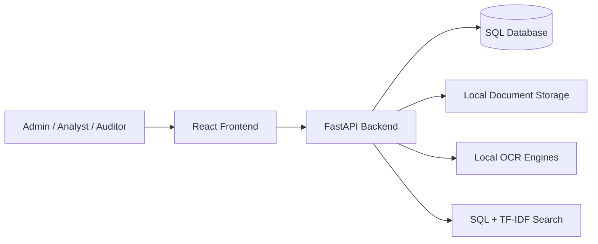
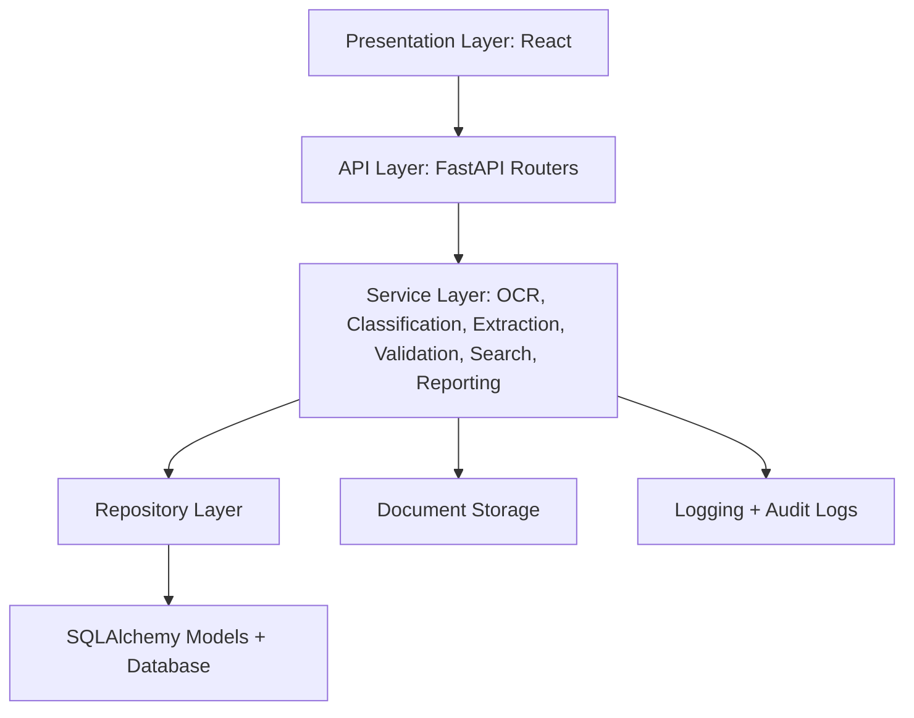
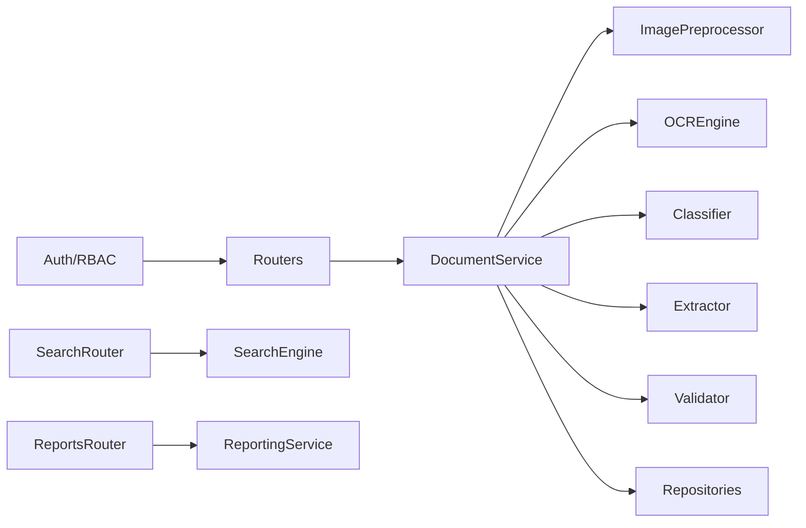
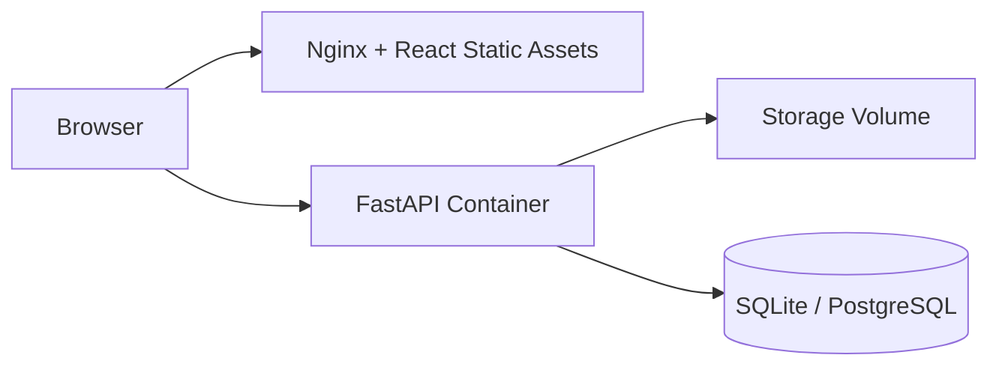
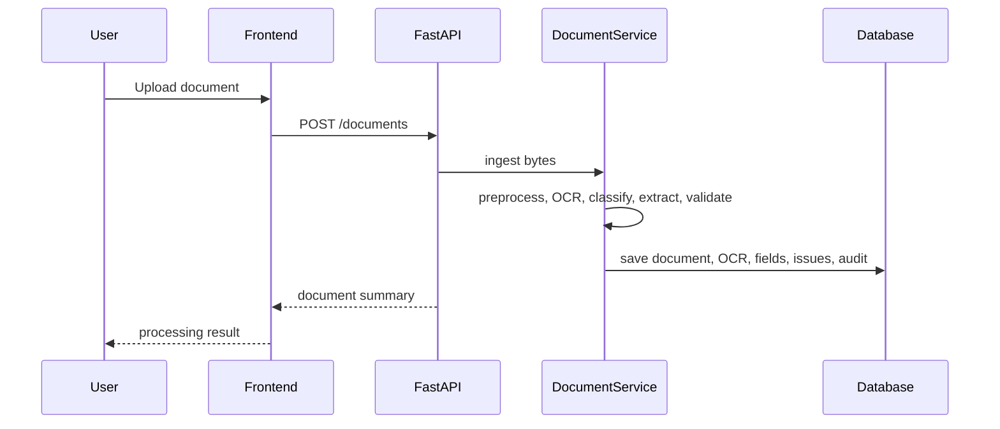

# System Architecture

## System Context

## Enterprise Architecture

## Component Diagram

## Deployment Diagram

## Sequence Diagram

## Security Architecture

- Passwords use PBKDF2-HMAC-SHA256.
- Tokens use compact HS256 JWT-compatible bearer tokens.
- RBAC is enforced through FastAPI dependencies.
- SQL injection protection is provided by SQLAlchemy parameterization.
- CORS origins are environment controlled.
- File scanning is a hook point before storage in `DocumentService.ingest_bytes`.
- Audit logs capture user activity.

## Scalability And Recovery

- Switch `DATABASE_URL` from SQLite to PostgreSQL for concurrent production use.
- Move storage path to shared volume or object storage when cloud deployment is required.
- Replace in-process OCR with a queue worker when throughput requires it.
- Use Alembic migrations for repeatable schema rollout.
- Back up SQL database and upload storage together.

## Monitoring

- API logs are structured through Python logging.
- Audit logs persist business actions.
- Add Prometheus/OpenTelemetry when there is a real runtime target.

