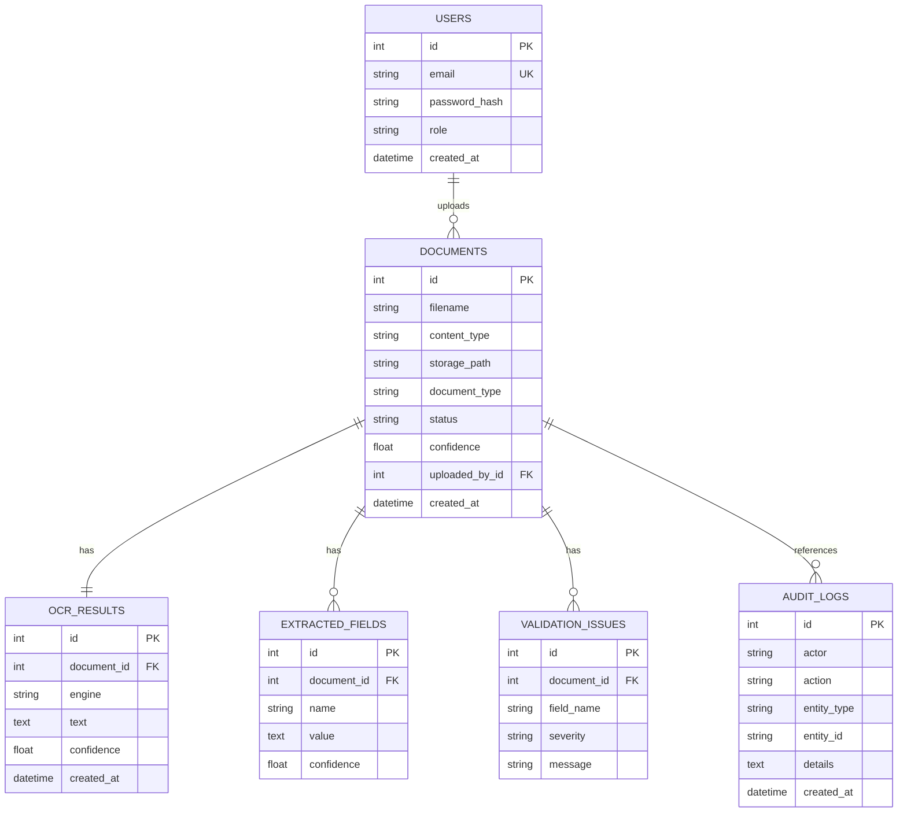

# Database Design

## ER Diagram

## Normalization

Document metadata, OCR text, extracted fields, validation issues, users, and audit logs are separate tables. This keeps one-to-many extraction and validation data queryable without JSON-only storage.

## Indexes

- `users.email` unique index.
- `documents.document_type`, `documents.status`, `documents.created_at`.
- `extracted_fields.document_id`, `extracted_fields.name`.
- `validation_issues.document_id`.
- `audit_logs.actor`, `audit_logs.action`, `audit_logs.created_at`.

## Storage Strategy

Binary files live in local storage under `UPLOAD_DIR`. Database rows store metadata and storage path. This keeps the database portable and avoids large BLOB churn.

## Search Strategy

Current search combines SQL text filtering with TF-IDF ranking. PostgreSQL FTS or FAISS can replace the ranking layer when document volume justifies it.

## Migration Strategy

Alembic revision `0001_initial_schema.py` creates the initial normalized schema. Future changes add forward-only revisions.

