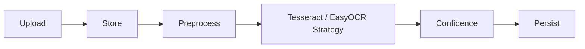
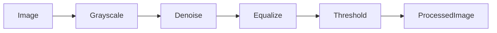
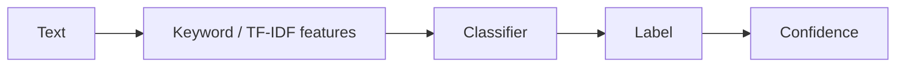
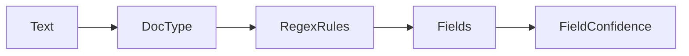
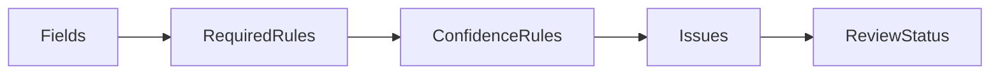
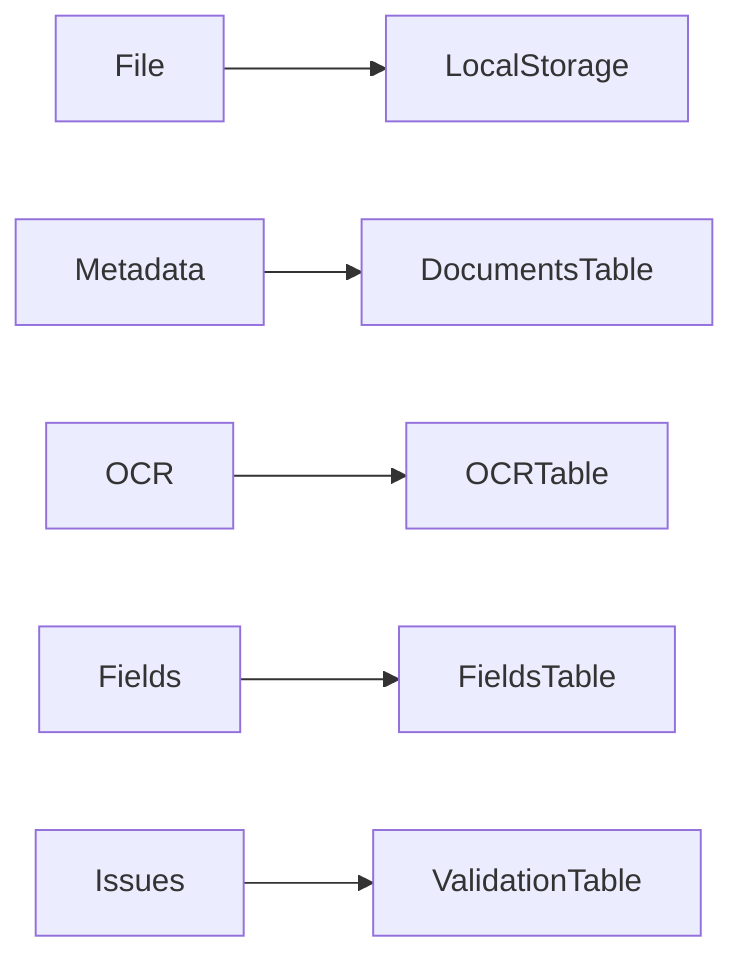
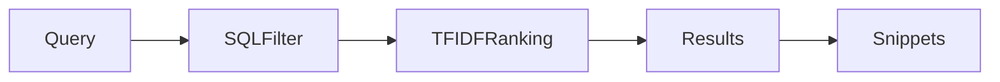
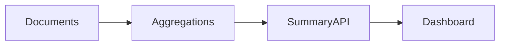
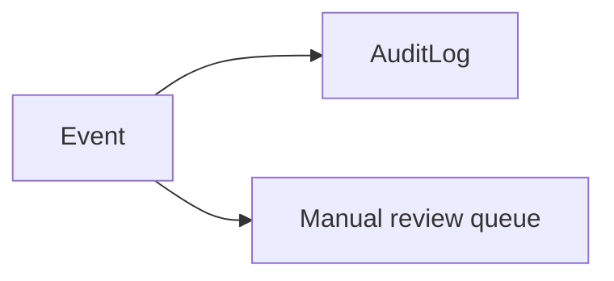
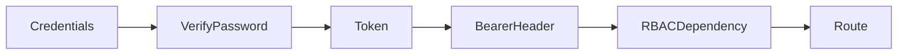

# Processing Pipelines

## OCR Pipeline

## Image Processing Pipeline

## Classification Pipeline

## Field Extraction Pipeline

## Validation Pipeline

## Storage Pipeline

## Search Pipeline

## Analytics Pipeline

## Notification Pipeline

## Authentication Flow

